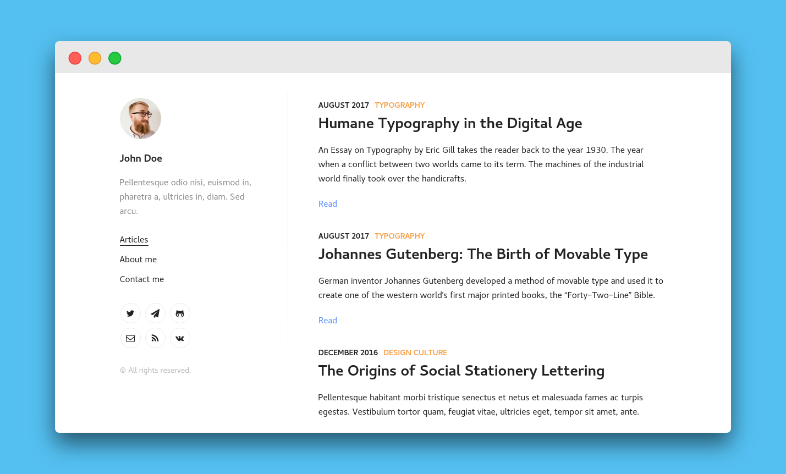

# demirdelic.com &middot; 

## Features

- Typography inspired by [matejlatin/Gutenberg](https://github.com/matejlatin/Gutenberg).
- Syntax highlighting in code blocks using [PrismJS](http://prismjs.com).
- [Mobile-First](https://medium.com/@mrmrs_/mobile-first-css-48bc4cc3f60f) approach in development.
- Archive organized by tags and categories.
- Pagination support.

## Run locally

#### Clone repository

`git clone https://github.com/demir-delic/demirdelic.com.git`

#### Navigate to project directory and install dependencies

`cd demirdelic.com && yarn install`

#### Install Gatsby command line tool

`yarn install --global gatsby-cli`

#### Start development server

`gatsby develop`

#### Create and serve production build

`gatsby build && gatsby serve`

## Screenshot (base Lumen install)

## Attribution

This site is based on [Lumen](https://github.com/alxshelepenok/gatsby-starter-lumen), a minimal, lightweight and mobile-first starter for creating blogs that use [Gatsby](https://github.com/gatsbyjs/gatsby). Lumen is maintained by [Alexander Shelepenok](https://github.com/alxshelepenok).

## License

[MIT licensed.](./LICENSE)
